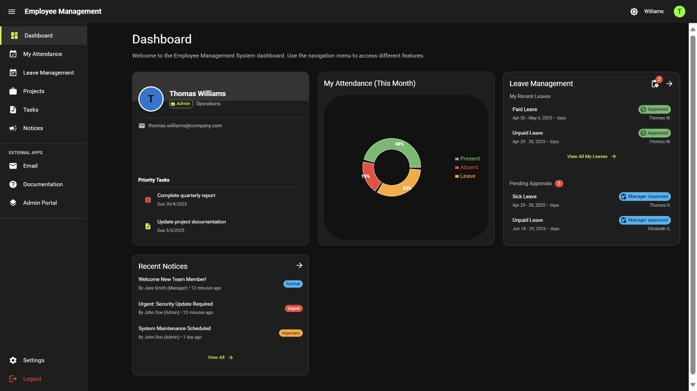
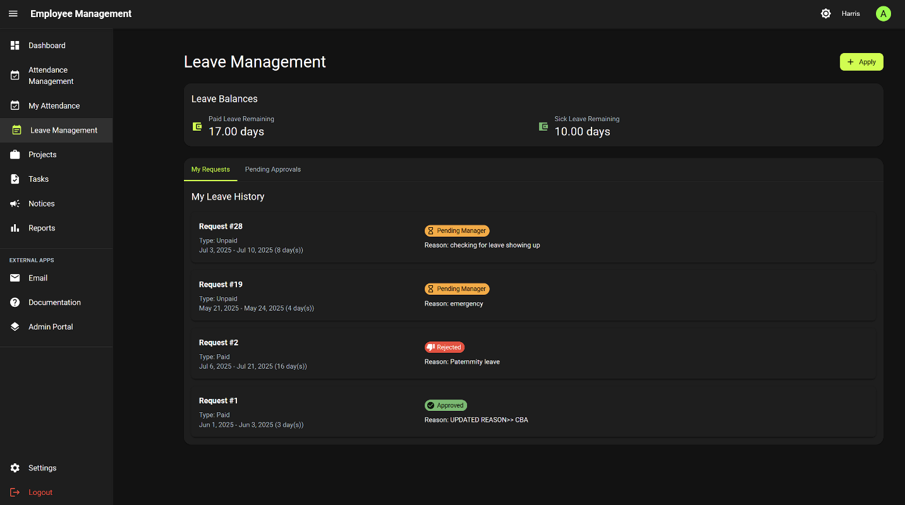
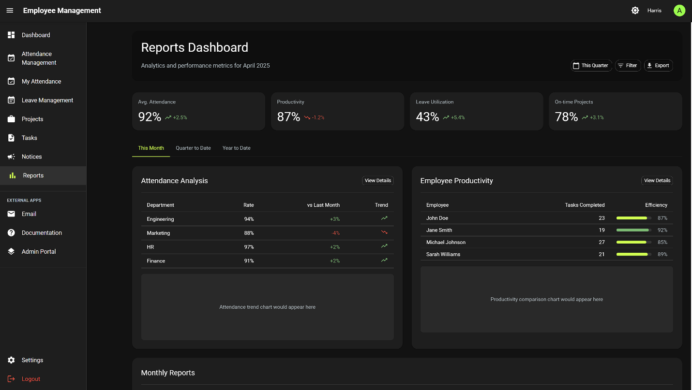
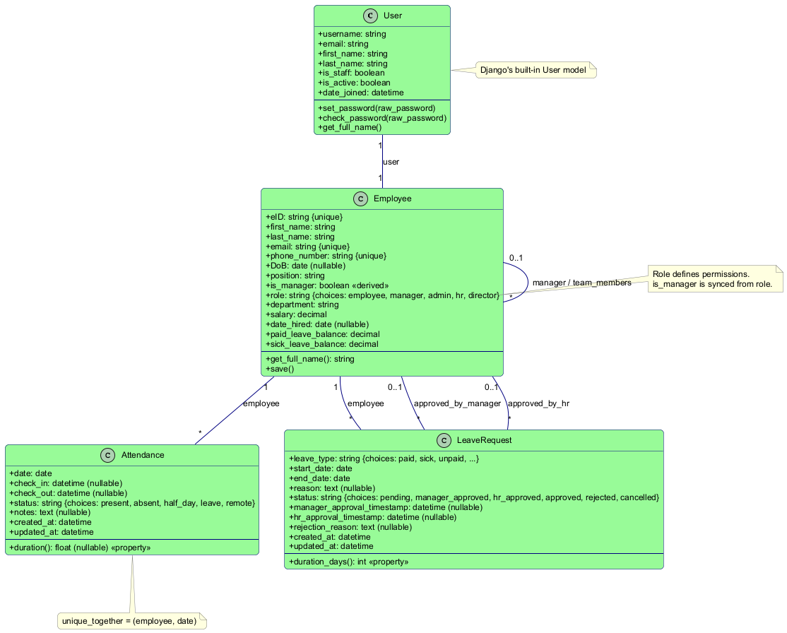
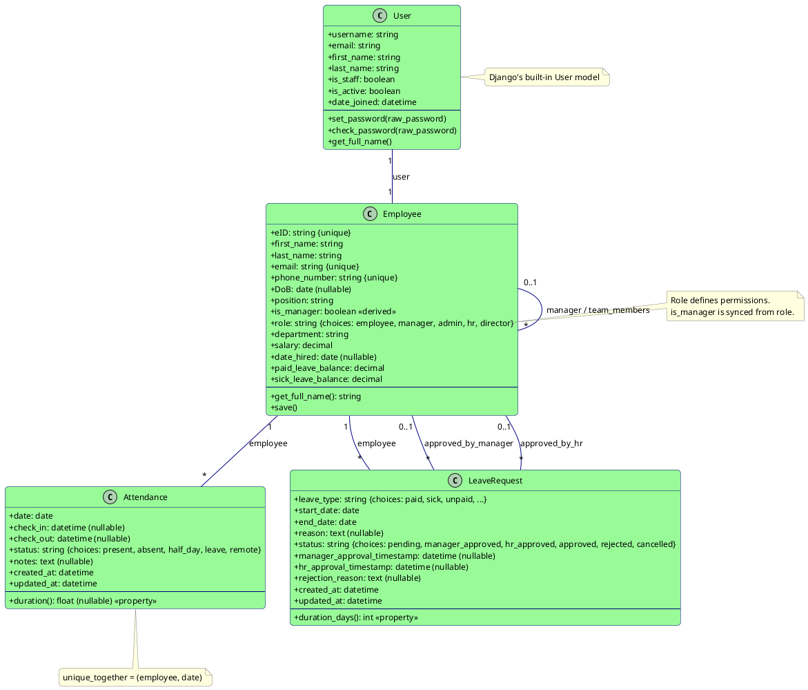

# Employee Management Application

This project consists of a Django backend and a React frontend for managing employees, attendance, leave, etc.


## Application Screenshots

### Dashboard


### Leave Management


### Reports Dashboard



## Database Schema

Below is the project's database schema visualised. The diagram shows the main entities and relationships used for users, employees, attendance and leave requests.



<details>
<summary>PlantUML source</summary>



</details>

Key entities

- User: Django's built-in authentication user. Stores credentials and basic profile fields.
- Employee: Extends the User with employment-specific data (employee id, role, department, leave balances, manager link).
- Attendance: Daily attendance records linked to an employee (check-in/out, status, notes).
- LeaveRequest: Employee leave requests with type, date range, approval status and timestamps.


## Prerequisites

*   **Python**: Version 3.8+ recommended.
*   **Node.js**: Version 14+ recommended, along with npm.
*   **Git**: For cloning the repository (if applicable).

## Backend Setup (Django)

1.  **Navigate to the project root directory:**
    ```bash
    cd d:\developement\employee_management
    ```

2.  **Create and activate a virtual environment (Recommended):**
    ```bash
    python -m venv venv
    .\venv\Scripts\activate  # On Windows
    # source venv/bin/activate # On macOS/Linux
    ```

3.  **Install Python dependencies:**
    *(Assuming a requirements.txt file exists)*
    ```bash
    pip install -r requirements.txt
    ```
    *(If no requirements.txt exists, you might need to install Django and other dependencies manually: `pip install django djangorestframework django-cors-headers djangorestframework-simplejwt psycopg2-binary ...`)*

4.  **Apply database migrations:**
    ```bash
    python manage.py migrate
    ```

5.  **Create a superuser (for accessing the Django Admin):**
    ```bash
    python manage.py createsuperuser
    ```
    Follow the prompts to set up a username, email, and password.

6.  **Run the backend development server:**
    ```bash
    python manage.py runserver
    ```
    The backend API will typically be available at `http://127.0.0.1:8000/` or `http://localhost:8000/`.

## Frontend Setup (React)

1.  **Navigate to the frontend directory:**
    ```bash
    cd d:\developement\employee_management\frontend
    ```

2.  **Node dependencies:**
    *(In the frontend dir)*
    ```bash
    .\frontend-requirements.txt
    ```

3.  **Install Node.js dependencies:**
    ```bash
    npm install
    ```

4.  **Run the frontend development server:**
    ```bash
    npm start
    ```
    The React application will typically open automatically in your browser at `http://localhost:3000/`. If not, open it manually.

## Accessing the Application

*   **Frontend Application:** `http://localhost:3000`
*   **Backend API:** `http://localhost:8000/api/` (Base URL, specific endpoints vary)
*   **Django Admin:** `http://localhost:8000/admin/` (Login with superuser credentials)

## Default Login Credentials (from structure.txt)

*   **Superuser:** `root` / `toor` (or the one you created)
*   **CMS Login:** `rk12345` / `admin@123`
*   **HR Login** `aw93521`/ `hr123` ; `th63996`/ `hr123`; 
*   **Manager:** `ah95579` / `manager123`
*   **Employee:** `dc41393` / `employee123`

*(Note: Use these credentials for testing purposes. Ensure they are changed or managed securely in a production environment.)*  

---

